# Hướng dẫn Toàn tập: Triển khai Ứng dụng Web lên AWS EC2 bằng Docker và Thiết lập CI/CD với GitHub Actions

Bài viết này hướng dẫn chi tiết cách "đóng gói" một ứng dụng Web (gồm Frontend React và Backend Node.js) bằng Docker, sau đó đưa lên máy chủ AWS EC2. Cuối cùng, thiết lập một luồng CI/CD với GitHub Actions để tự động hóa hoàn toàn quá trình triển khai.

*Lưu ý: Để bài hướng dẫn ngắn gọn và tập trung vào luồng CI/CD, máy ảo EC2 sẽ được tạo trong Default VPC. Trong thực tế, nên cấu hình VPC riêng để bảo mật hơn.*

---

## Phần 1: Chuẩn bị Source Code (Thực hiện trên máy cá nhân)

Trước khi thao tác với server, mã nguồn dự án cần được cấu hình Docker và đẩy lên GitHub. Để tiết kiệm thời gian, có thể tham khảo trực tiếp source code mẫu đã được setup sẵn từ A-Z (đã bao gồm file `docker-compose.yml`, cấu hình Nginx proxy và kết nối DB bằng biến môi trường).

**Kho lưu trữ mã nguồn mẫu:**
https://github.com/dragoncoil2609/reactsurvey.git

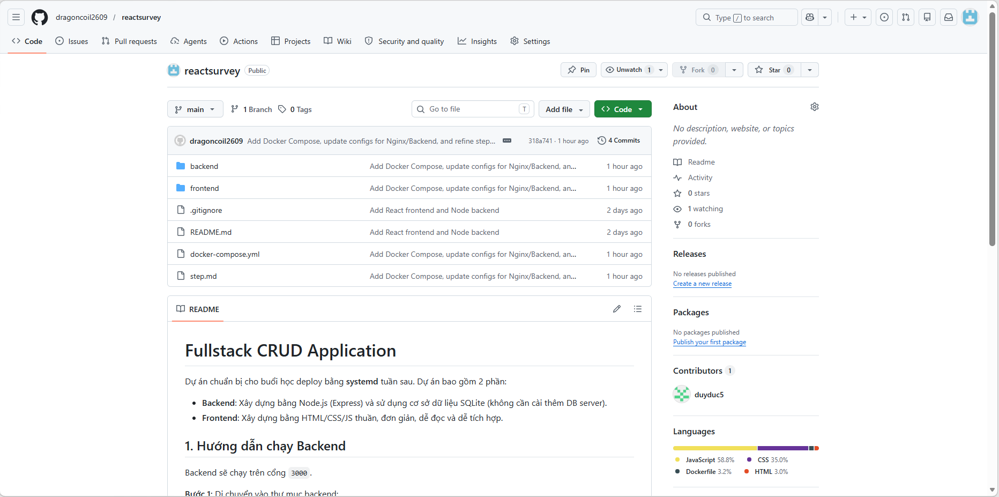

---

## Phần 2: Chuẩn bị Server và Chạy thử (Thực hiện trên AWS EC2)

### Bước 2.1: Tạo máy ảo EC2
Thao tác trên giao diện của AWS:

1. Đăng nhập AWS Console, vào dịch vụ **EC2** > chọn **Launch Instance**.
2. **OS**: Chọn **Ubuntu Server 22.04 LTS** (hoặc 24.04 LTS).
3. **Network**: Dùng Default VPC để có sẵn Public IP.
4. **Security Group**: Mở port `22` (để SSH) và port `80` (để truy cập Web).
5. Tạo và tải về máy một **Key Pair** (ví dụ: `my-key.pem`).


### Bước 2.2: Cài đặt Docker bằng Shell Script
Mở terminal và SSH vào server vừa tạo bằng lệnh sau:
```bash
ssh -i /path/to/my-key.pem ubuntu@<PUBLIC_IP_CỦA_EC2>
```

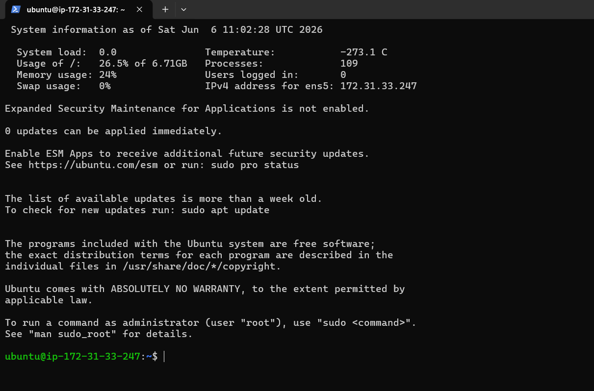

Sử dụng đoạn script sau để tự động cài đặt Docker và Docker Compose:

**1. Tạo file script:**
```bash
mkdir tools && cd tools
mkdir docker && cd docker/
nano install-docker.sh
```

**2. Copy/Paste nội dung này vào file:**
```bash
#!/bin/bash
sudo apt update
sudo apt install -y apt-transport-https ca-certificates curl software-properties-common
curl -fsSL https://download.docker.com/linux/ubuntu/gpg | sudo gpg --dearmor -o /usr/share/keyrings/docker-archive-keyring.gpg
echo "deb [signed-by=/usr/share/keyrings/docker-archive-keyring.gpg] https://download.docker.com/linux/ubuntu $(lsb_release -cs) stable" | sudo tee /etc/apt/sources.list.d/docker.list > /dev/null
sudo apt update
sudo apt install -y docker-ce
sudo systemctl start docker
sudo systemctl enable docker
sudo curl -L "https://github.com/docker/compose/releases/latest/download/docker-compose-$(uname -s)-$(uname -m)" -o /usr/local/bin/docker-compose
sudo chmod +x /usr/local/bin/docker-compose
docker --version
docker-compose --version
```
*(Sử dụng tổ hợp phím Ctrl+O, Enter để lưu, rồi Ctrl+X để thoát).*

**3. Chạy script cài đặt:**
```bash
chmod +x install-docker.sh
bash install-docker.sh

# Cấp quyền cho user ubuntu:
sudo usermod -aG docker ubuntu
```
*(Lưu ý: Gõ lệnh `exit` để thoát SSH, sau đó SSH lại để quyền mới có tác dụng!)*

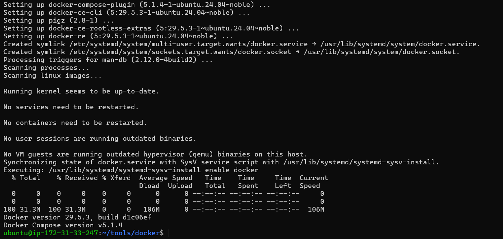

### Bước 2.3: Chạy thử thủ công (Manual Deploy)
*Nguyên tắc của DevOps: Luôn đảm bảo ứng dụng chạy được thủ công trước khi thiết lập CI/CD tự động.*

1. Clone source code từ kho GitHub về máy ảo EC2:
```bash
git clone https://github.com/your-username/your-repo-name.git ~/app
```
2. Di chuyển vào thư mục và khởi chạy dự án:
```bash
cd ~/app
docker-compose up -d --build
```

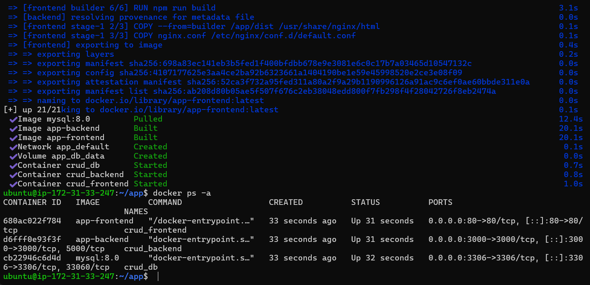

3. Mở trình duyệt, truy cập vào **Public IP** của EC2 để kiểm tra giao diện trang web.

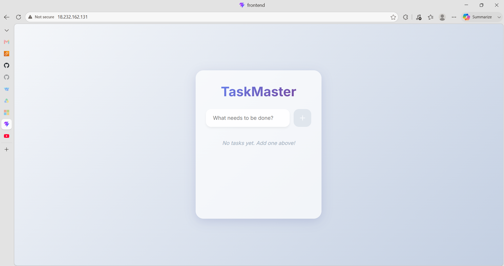

4. Sau khi xác nhận ứng dụng hoạt động ổn định, gõ lệnh sau để dừng ứng dụng và dọn dẹp môi trường cho GitHub Actions:
```bash
docker-compose down
```

---

## Phần 3: Cấu hình CI/CD bằng GitHub Actions (Tự động hóa)

Khi mã nguồn và server đã sẵn sàng, tiến hành thiết lập luồng CI/CD tự động 3 bước: **Build -> Deploy -> Show Log**.

### Bước 3.1: Thiết lập GitHub Secrets
*Giải thích: Mục đích của bước này là cung cấp thông tin xác thực để môi trường GitHub Actions có quyền kết nối vào máy chủ EC2. Việc lưu trữ thông tin trong hệ thống Secrets giúp bảo vệ địa chỉ IP và khóa SSH, ngăn chặn rò rỉ thông tin nhạy cảm công khai trên kho mã nguồn.*

Trên giao diện repo GitHub, vào **Settings > Secrets and variables > Actions** và thêm 3 biến bảo mật sau:
1. `EC2_HOST`: Địa chỉ IP Public của EC2.
2. `EC2_USERNAME`: `ubuntu`
3. `EC2_SSH_KEY`: Nội dung file `my-key.pem`.

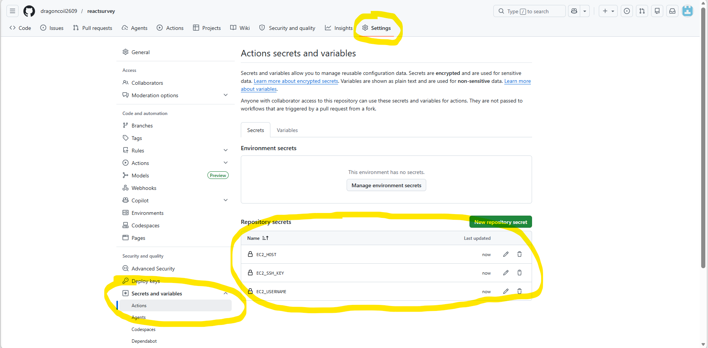

### Bước 3.2: Tạo Workflow File
*Giải thích: File YAML này đóng vai trò là kịch bản (pipeline) chỉ đạo GitHub thực hiện chuỗi 3 công việc (jobs) một cách tuần tự mỗi khi có thay đổi trên nhánh `main`:*
*- **Build**: Kiểm tra thử việc đóng gói Docker Image để đảm bảo mã nguồn không bị hỏng trước khi đưa lên server thực tế.*
*- **Deploy**: Tự động sao chép mã nguồn mới sang máy ảo EC2 qua giao thức SCP, sau đó gửi lệnh SSH để yêu cầu Docker Compose khởi động lại hệ thống với phiên bản mới nhất.*
*- **Show log**: In trạng thái hoạt động của các container ra màn hình giao diện GitHub để người quản trị dễ dàng giám sát.*

Tại máy tính cá nhân, tạo một file tên là `.github/workflows/deploy.yml` trong thư mục dự án:

```yaml
name: CI/CD Pipeline Docker

# [NÂNG CẤP] Chống "đụng xe" khi nhiều người Push code cùng lúc
concurrency:
  group: ${{ github.workflow }}-${{ github.ref }}
  cancel-in-progress: true

on:
  push:
    branches:
      - main # [TÙY CHỈNH] Thay bằng nhánh kích hoạt CI/CD của bạn (vd: master, dev)

jobs:
  # Bước 1: Kiểm tra xem source code có Build thành Docker Image thành công không
  build:
    name: 1. Build
    runs-on: ubuntu-latest
    timeout-minutes: 10 # [NÂNG CẤP] Hủy luồng nếu chạy quá 10 phút để tránh tốn tiền
    steps:
      - name: Checkout code
        uses: actions/checkout@v4

      - name: Kiểm tra Build dự án
        run: |
          echo "Thử build Docker Image để đảm bảo code không lỗi trước khi deploy..."
          # [TÙY CHỈNH] Lệnh build tương ứng với dự án
          docker compose build

  # Bước 2: Bắn code sang Server và yêu cầu Docker khởi chạy
  deploy:
    name: 2. Deploy
    runs-on: ubuntu-latest
    needs: build
    steps:
      - name: Checkout code
        uses: actions/checkout@v4

      - name: Copy source code lên Server
        uses: appleboy/scp-action@v0.1.7
        with:
          host: ${{ secrets.EC2_HOST }}         # Khai báo IP Server trong GitHub Secrets
          username: ${{ secrets.EC2_USERNAME }} # Khai báo User (vd: ubuntu, root)
          key: ${{ secrets.EC2_SSH_KEY }}       # Khóa Private Key .pem
          source: "./*"
          target: "~/app"                       # [TÙY CHỈNH] Đường dẫn thư mục chứa code trên Server

      - name: Triển khai tự động bằng Docker Compose
        uses: appleboy/ssh-action@v1.0.3
        with:
          host: ${{ secrets.EC2_HOST }}
          username: ${{ secrets.EC2_USERNAME }}
          key: ${{ secrets.EC2_SSH_KEY }}
          script: |
            # [TÙY CHỈNH] Di chuyển vào thư mục chứa dự án
            cd ~/app
            
            # Dừng các container cũ và khởi động lại với code mới (chạy ngầm)
            docker compose down
            docker compose up -d --build

  # Bước 3: Kiểm tra trạng thái các Container
  show_log:
    name: 3. Test / Show log
    runs-on: ubuntu-latest
    needs: deploy
    steps:
      - name: In log trạng thái
        uses: appleboy/ssh-action@v1.0.3
        with:
          host: ${{ secrets.EC2_HOST }}
          username: ${{ secrets.EC2_USERNAME }}
          key: ${{ secrets.EC2_SSH_KEY }}
          script: |
            cd ~/app # [TÙY CHỈNH] Di chuyển vào thư mục chứa dự án
            echo "--- Danh sách Container đang chạy ---"
            docker ps
            
            echo "--- LOG HOẠT ĐỘNG ---"
            docker compose logs --tail=50
```

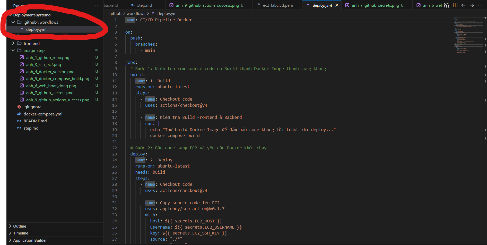

### Bước 3.3: Kết quả triển khai tự động
*Giải thích: Bước này đóng vai trò kích hoạt chu trình CI/CD vừa thiết lập. Thông qua tab Actions, người quản trị có thể giám sát toàn bộ quá trình tự động hóa theo thời gian thực (real-time) mà không cần phải đăng nhập trực tiếp vào máy chủ EC2.*

Thực hiện commit file `deploy.yml` và push lên nhánh `main`. 

Mở tab **Actions** trên kho GitHub để kiểm tra. Quá trình sẽ tự động chạy nối tiếp 3 bước (Build, Deploy, Show log). 

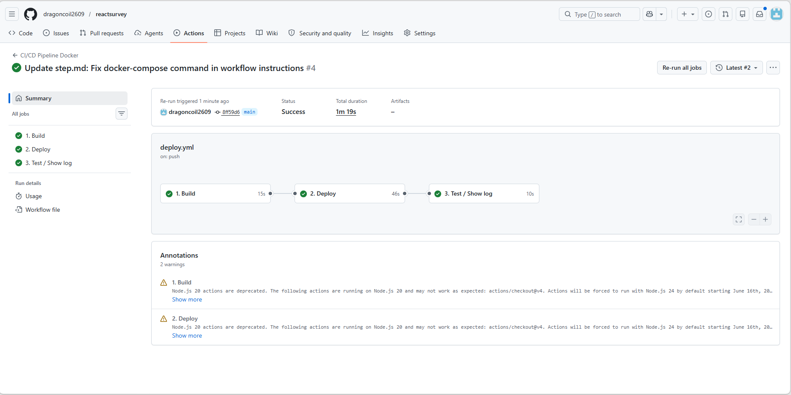

Từ bây giờ, mỗi khi có code mới được Push lên nhánh main, ứng dụng sẽ tự động được triển khai lên máy chủ EC2. Quá trình cấu hình CI/CD hoàn tất!

## Phần 4: Kiểm chứng tính năng CI/CD tự động

Sau khi thiết lập thành công, bước tiếp theo là kiểm chứng tính năng tự động hóa bằng cách thực hiện một thay đổi nhỏ trên giao diện Frontend và quan sát kết quả thực tế trên server.

### Bước 4.1: Chỉnh sửa mã nguồn Frontend
*Giải thích: Thao tác này giả lập quá trình phát triển (development) thực tế. Lập trình viên chỉ cần thay đổi code tại máy cá nhân, mọi việc triển khai còn lại hệ thống CI/CD sẽ tự lo.*

Mở file `frontend/src/App.jsx` trên máy tính cá nhân, tìm đến phần giao diện và sửa đổi một đoạn văn bản (text) hoặc thêm một nút bấm (button) để dễ dàng nhận diện phiên bản mới. Ví dụ:

```jsx
// Tìm dòng chứa thẻ <h1> và sửa thành:
<h1>🚀 To-Do List (Đã tự động hóa CI/CD!)</h1>

// Hoặc chèn thêm một đoạn text thông báo bên dưới:
<p style={{ color: 'green', textAlign: 'center', fontWeight: 'bold' }}>
  Phiên bản mới nhất đã lên sóng tự động!
</p>
```

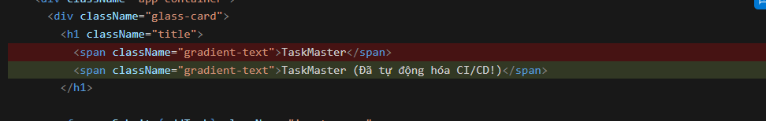

### Bước 4.2: Đẩy code lên GitHub (Push)
Thực hiện các lệnh Git quen thuộc trên Terminal của máy cá nhân để ghi nhận sự thay đổi và đẩy code lên nhánh `main`:

```bash
git add frontend/src/App.jsx
git commit -m "Cập nhật giao diện: Thêm thông báo kiểm tra CI/CD"
git push
```
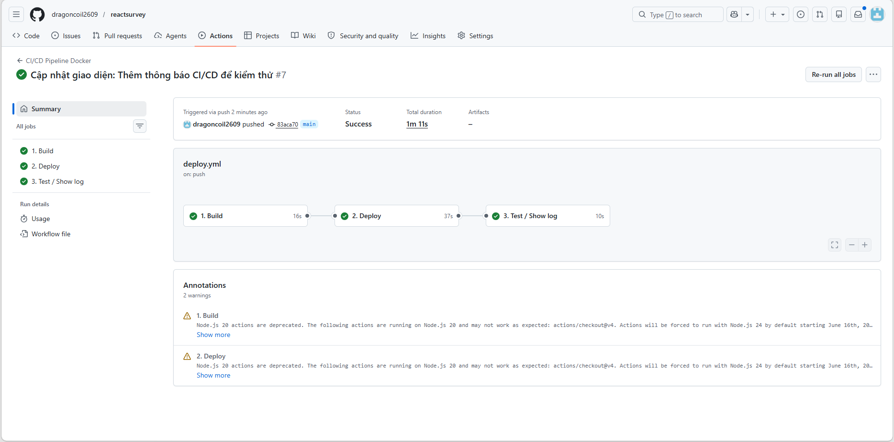

### Bước 4.3: Hưởng thụ thành quả tự động hóa
Ngay sau khi lệnh Push hoàn tất, hệ thống GitHub Actions sẽ lập tức bắt được tín hiệu "có code mới" và kích hoạt luồng Deploy.

1. Chuyển sang tab **Actions** trên GitHub, bạn sẽ thấy một tiến trình mới đang tự động chạy qua các bước Build và Deploy.
2. Đợi khoảng 1-2 phút cho đến khi tất cả các bước báo dấu tick xanh lá.
3. Mở trình duyệt và truy cập lại vào **Public IP** của máy chủ EC2. 
4. Giao diện mới với dòng chữ vừa sửa sẽ lập tức hiện ra mà bạn không cần phải đăng nhập SSH hay gõ bất kỳ dòng lệnh nào trên server!

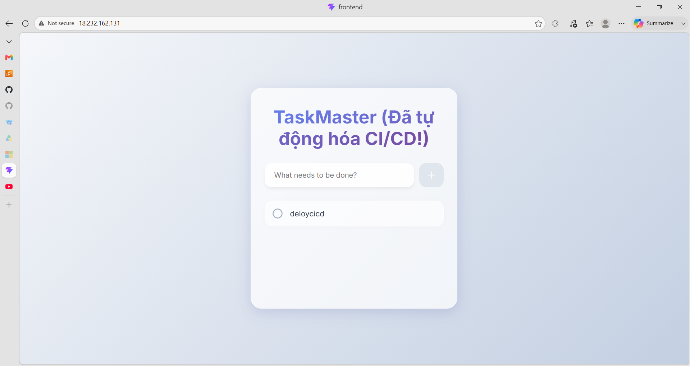

Đây chính là giá trị cốt lõi của DevOps và quy trình CI/CD: Giải phóng lập trình viên khỏi các tác vụ thủ công lặp đi lặp lại, giúp họ chỉ cần tập trung hoàn toàn vào việc phát triển tính năng.

## Phần 5: 
Các câu lệnh thiết yếu khi làm việc với CI/CD

Trong quá trình phát triển dự án hàng ngày, thao tác với Git là cầu nối trực tiếp để tương tác với hệ thống CI/CD. Dưới đây là danh sách các lệnh "nằm lòng" để bạn tra cứu nhanh:

### 1. Đẩy code và kích hoạt luồng CI/CD
Đây là bộ ba câu lệnh bạn sẽ dùng nhiều nhất. Ngay sau lệnh cuối cùng, quá trình CI/CD sẽ tự động chạy.
```bash
# B1: Gom tất cả các file vừa chỉnh sửa
git add .

# B2: Đóng gói và ghi chú lại nội dung bạn vừa thay đổi
git commit -m "Mô tả tính năng hoặc lỗi vừa sửa..."

# B3: Đẩy code lên GitHub (GitHub Actions sẽ được kích hoạt ngay lập tức)
git push
```

### 2. Đẩy code nhưng BỎ QUA luồng CI/CD (Tiết kiệm tài nguyên)
Nếu bạn chỉ sửa lỗi chính tả trong file văn bản (như README) và không muốn lãng phí sức mạnh máy chủ để Build/Deploy lại toàn bộ dự án, hãy sử dụng thủ thuật này:
```bash
git add .
# Chèn thêm từ khóa [skip ci] vào đầu câu ghi chú
git commit -m "[skip ci] Sửa lỗi chính tả file Readme"
git push
```
*Giải thích: Khi GitHub Actions nhìn thấy từ khóa `[skip ci]`, nó sẽ tự động hủy luồng chạy, giúp tiết kiệm phút chạy miễn phí (quota) của bạn trên GitHub.*

### 3. Đồng bộ Code (Pull)
Nếu dự án có nhiều người cùng làm, hoặc bạn vừa chỉnh sửa file trực tiếp trên giao diện web của GitHub, bạn bắt buộc phải kéo code mới nhất về máy cá nhân trước khi làm việc tiếp:
```bash
git pull
```

### 4. Kiểm tra trạng thái hiện tại
Khi bạn làm việc quá lâu và quên mất mình đã sửa những file nào, hoặc file nào chưa được `git add`:
```bash
git status
```

---

## Phần 6: Nâng cấp luồng CI/CD đạt chuẩn Enterprise (Những góc khuất khi đọc kỹ Docs)

Để đưa quy trình CI/CD từ mức "chạy được" lên mức "chạy chuẩn Doanh nghiệp", chúng ta cần lường trước các rủi ro mà các tài liệu cơ bản thường bỏ qua. Trong file `deploy.yml` mẫu ở Phần 3.2, chúng ta đã chủ động tích hợp sẵn những cấu hình "ăn tiền" sau:

### 1. Cơ chế chống đụng độ (Concurrency Control)
- **Vấn đề:** Điều gì xảy ra nếu 2 lập trình viên push code cách nhau 10 giây? GitHub Actions sẽ tạo 2 máy ảo chạy song song, cùng lúc kết nối SSH vào EC2 và gõ lệnh `docker compose up`. Hậu quả: Xung đột cổng (port clash), database bị lock, và web sập.
- **Giải pháp:** Cấu hình `concurrency` (như trong file mẫu) để tự động hủy luồng cũ và chỉ ưu tiên chạy luồng code mới nhất.

### 2. Quản trị rủi ro tài chính (Timeout-minutes)
- **Vấn đề:** Nếu quá trình Build bị kẹt (ví dụ đứt cáp mạng khi tải thư viện `npm install`), mặc định GitHub Actions sẽ treo luồng đó trong tối đa **360 phút (6 tiếng)**. Hậu quả: Cháy sạch số phút chạy miễn phí (quota) của tháng, hoặc công ty bị tính tiền oan.
- **Giải pháp:** Cài đặt `timeout-minutes: 10`. Hệ thống sẽ tự động hủy tiến trình nếu chạy quá thời gian này.

### 3. Bảo mật kết nối SSH (Tránh tấn công MITM)
- Đa số các bài hướng dẫn trên mạng chỉ dùng host, username và key. Nhưng theo tài liệu bảo mật của GitHub, nếu không cấu hình dấu vân tay (`fingerprint`) hoặc phớt lờ Host Key, hacker có thể sử dụng kỹ thuật Man-in-the-Middle (MITM) để giả mạo máy chủ EC2 của bạn và đánh cắp source code. Luồng deploy chuyên nghiệp luôn phải tuân thủ nghiêm ngặt bảo mật SSH.

### 4. Bẫy "Thành công Ảo" (Fake Success) và Healthcheck
- Khi Action chạy lệnh `docker compose up -d`, nó báo xanh (Success) ngay lập tức. Nhưng thực tế, Node.js mất 5-10 giây để kết nối DB. Nếu bạn vào web ngay lúc đó, bạn có thể dính lỗi 502 Bad Gateway. 
- Để chuyên nghiệp hơn, ở cấu hình `docker-compose.yml`, chúng ta đã thiết lập `healthcheck` cho database. Nhờ đó, ứng dụng Backend (Node.js) chỉ thực sự khởi động khi Database (MySQL) đã sẵn sàng 100%. Đây là chìa khóa để đạt được khái niệm **Zero Downtime Deployment**!
