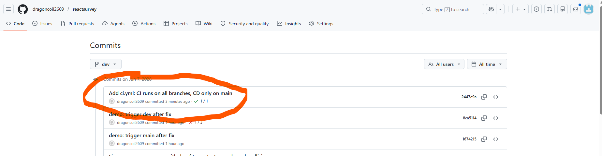
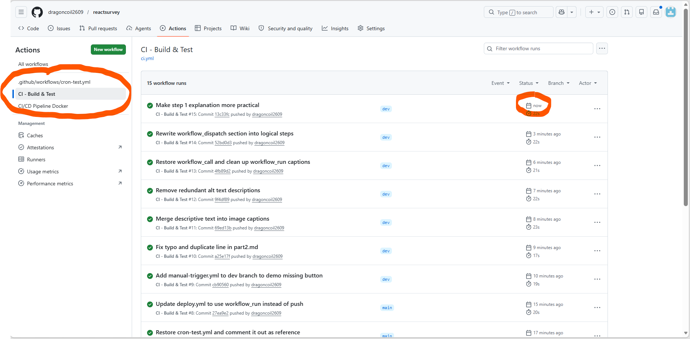

# CI/CD Phần 2: Những điểm dễ sai khi dùng GitHub Actions

Phần 1 đã dựng được luồng CI/CD cơ bản. Phần này đi vào ba chỗ thường gây lỗi thầm lặng: cơ chế chống đụng độ, quy tắc GitHub chọn nhánh để đọc file YAML, và họ sự kiện `workflow_*`.

---

## 1. Concurrency Control

Mặc định, mỗi lần push kích hoạt một luồng Actions chạy độc lập. Nếu hai developer push cách nhau 10 giây, Actions tạo hai máy ảo song song, cùng SSH vào EC2 và chạy `docker compose up`. Kết quả là xung đột cổng, database bị lock, hoặc sập web.

Thêm `concurrency` vào file `deploy.yml` để Actions hủy luồng cũ khi có luồng mới hơn cùng nhóm:

```yaml
concurrency:
  group: ${{ github.workflow }}-${{ github.ref }}
  cancel-in-progress: true
```

Tuy nhiên, cấu hình trên chỉ bảo vệ trong phạm vi **cùng nhánh**. `${{ github.ref }}` là tên nhánh, nên push từ `main` và push từ `dev` vào cùng lúc tạo ra hai concurrency group khác nhau — vẫn chạy song song, vẫn đụng nhau trên cùng một server EC2.

Nếu nhiều nhánh cùng deploy lên một server, bỏ `${{ github.ref }}` ra:

```yaml
concurrency:
  group: ${{ github.workflow }}
  cancel-in-progress: true
```

Khi đó mọi luồng của cùng một workflow đều vào chung một nhóm, bất kể nhánh nào.

**Cấu hình ban đầu — chỉ bảo vệ trong cùng nhánh:**

Đây là cấu hình phổ biến nhất trên các tutorial. Nhìn qua có vẻ đúng, nhưng chứa một lỗ hổng ẩn.


**Kiểm chứng:**

Để tái hiện, chúng ta thêm cả nhánh `dev` vào danh sách trigger, rồi push lên `main` và `dev` gần như cùng lúc. Hai push tạo ra hai concurrency group khác nhau — `pipeline-refs/heads/main` và `pipeline-refs/heads/dev` — và GitHub chạy song song cả hai mà không hủy cái nào.


Nhìn vào ảnh: luồng từ `main` và luồng từ `dev` cùng trạng thái *In progress* / *Pending* một lúc. Tại thời điểm đó, cả hai đều đang SSH vào cùng một server EC2 và chạy `docker compose up` — đây chính là lúc xung đột cổng và database lock có thể xảy ra.

**Giải pháp — bỏ `github.ref` khỏi tên nhóm:**

Thay đổi duy nhất là bỏ `-${{ github.ref }}` ra khỏi `group`. Khi đó tất cả luồng của cùng workflow — dù từ nhánh nào — đều chung một nhóm, luồng cũ hơn bị hủy ngay khi luồng mới vào hàng.


Sau khi push lại và lặp lại cùng thao tác, kết quả trên tab Actions thay đổi hoàn toàn: luồng cũ bị đánh dấu *Cancelled* ngay lập tức, chỉ luồng mới nhất được phép tiếp tục.


---

## 2. GitHub chọn nhánh nào để đọc file YAML?

Quan niệm phổ biến: file YAML ở nhánh nào thì GitHub đọc nhánh đó. Đúng, nhưng chỉ với một nhóm sự kiện nhất định.

GitHub Actions chạy theo sự kiện. Khi sự kiện xảy ra, GitHub cần xác định: *sự kiện này thuộc về nhánh nào, để biết đọc file YAML ở đâu?*

**Sự kiện từ code** (`push`, `pull_request`): GitHub biết rõ ngữ cảnh — push vào nhánh `dev` thì đọc file YAML ở `dev`. Đúng như kỳ vọng.



**Sự kiện từ ngoại cảnh** (`schedule`, `issue_comment`, v.v.): Thời gian hay một bình luận vào Issue không gắn với nhánh nào. GitHub không thể mò từng nhánh để tìm cấu hình liên quan — với repo có hàng trăm nhánh, đó là bài toán không giải được. Cách GitHub xử lý: chỉ đọc file YAML ở **nhánh mặc định** (`main`). File ở nhánh khác không được đọc, không phát sinh lỗi, chỉ đơn giản là bị bỏ qua.

Ví dụ thường gặp: tạo nhánh `test-cron`, viết file hẹn giờ chạy mỗi phút, push lên. Đợi vài phút không có gì xảy ra.


Để lịch có hiệu lực, file đó phải được merge vào `main`.


> **Quy tắc:** sự kiện từ code đọc YAML ở nhánh của code đó; sự kiện từ ngoại cảnh đọc YAML ở `main`.

---

## 3. Họ `workflow_*`

Ba sự kiện `workflow_dispatch`, `workflow_call`, `workflow_run` đều thuộc loại ngoại cảnh. Áp dụng quy tắc ở Phần 2: file YAML chứa chúng phải nằm trên nhánh `main` thì GitHub mới nhận diện và kích hoạt được.

### `workflow_dispatch`

Sự kiện này sinh ra nút bấm "Run workflow" trên giao diện web GitHub, cho phép kích hoạt CI/CD thủ công bất cứ lúc nào mà không cần push code.

**Code minh họa:**
```yaml
on:
  workflow_dispatch:
    inputs:
      môi_trường:
        description: 'Môi trường deploy (staging/prod)'
        required: true
        default: 'staging'
```

**Bản chất và quy tắc hoạt động:**
- **Giải quyết bài toán gì?** Không phải lúc nào chúng ta cũng muốn tự động hóa 100%. Có những thao tác cực kỳ nhạy cảm (như deploy lên Production, dọn dẹp server, rollback) cần sự kiểm soát thủ công của con người. `workflow_dispatch` sinh ra để biến Actions thành chiếc "công tắc" bấm tay. Nó còn cho phép truyền thêm tham số đầu vào trực tiếp ngay trên giao diện web.
- **Dùng khi nào?** Bất cứ khi nào bạn cần chạy một tác vụ DevOps một cách chủ động theo ý muốn, không phụ thuộc vào việc lập trình viên có push code hay không.
- **Yêu cầu về nhánh:** Giống các thành viên trong họ `workflow_*`, file YAML chứa công tắc này **bắt buộc phải nằm ở nhánh `main`** để giao diện GitHub có thể nhận diện và vẽ ra nút bấm cho bạn.

**Lỗi hay gặp:** viết `on: workflow_dispatch` vào một file ở nhánh `dev`, push lên, rồi vào tab Actions tìm nút bấm — nhưng tìm mãi không thấy. 

Lý do là giao diện web của GitHub chỉ quét nhánh `main` để vẽ nút bấm, hoàn toàn tuân theo quy tắc "sự kiện ngoại cảnh" đã nói ở trên.

**Bước 1: Nút k chạy**
Nếu bạn chỉ push file định nghĩa nút bấm lên nhánh `dev` mà chưa merge vào `main`, nút bấm sẽ không hiện ra. Nhìn vào cột menu bên trái, workflow này hoàn toàn mất tích.



**Bước 2: Kích hoạt nút bấm**
Để nút bấm hiện ra, bắt buộc phải merge file đó vào nhánh `main`. Ngay sau khi merge, giao diện sẽ lập tức cập nhật và nút "Run workflow" sẽ xuất hiện ở góc phải.


**Bước 3: Sự linh hoạt của việc chọn nhánh**
Điểm thú vị nhất của `workflow_dispatch` nằm ở đây: Tuy file định nghĩa nút bấm bắt buộc phải "ký gửi" ở `main`, nhưng khi chạy, GitHub cho phép bạn **chọn lấy code từ bất kỳ nhánh nào**.


### `workflow_call`

Sự kiện này biến một file YAML thành thư viện tái sử dụng — file YAML khác ở bất kỳ repo nào trong tổ chức đều có thể gọi vào.

**Code minh họa:**
```yaml
on:
  workflow_call:
    inputs:
      tên_dự_án:
        required: true
        type: string
```

**Bản chất và quy tắc hoạt động:**
- **Giải quyết bài toán gì?** Bệnh "Copy-Paste". Nếu bạn có 50 repo với quy trình deploy y hệt nhau, việc copy file `deploy.yml` sang 50 chỗ sẽ tạo ra cơn ác mộng bảo trì. Khi có thay đổi, bạn phải sửa thủ công 50 lần. `workflow_call` biến 1 file YAML trung tâm thành một "hàm" dùng chung: chỉ cần sửa 1 chỗ, 50 repo còn lại tự động được cập nhật.
- **Dùng khi nào?** Khi dự án lớn lên thành mô hình microservices, hoặc công ty có nhiều dự án chạy chung một tiêu chuẩn CI/CD (như chung cách build Docker, chung cách scan lỗi).
- **Yêu cầu về nhánh:** File gốc dùng để gọi (caller workflow) vẫn tuân theo quy tắc phải nằm ở nhánh `main`. Còn bản thân cái file thư viện trung tâm (chứa `on: workflow_call`) thì khi gọi, bạn bắt buộc phải trỏ chính xác nó đang nằm ở nhánh/tag nào (VD: `uses: org/repo/.github/workflows/template.yml@main`).


### `workflow_run`

Sự kiện này kích hoạt một workflow tự động ngay khi một workflow khác vừa chạy xong.

**Code minh họa:**
```yaml
on:
  workflow_run:
    workflows: ["Tên của file CI cần đợi"]
    types:
      - completed
    branches:
      - main
```

**Bản chất và quy tắc hoạt động:**
- **Giải quyết bài toán gì?** Nếu dùng `on: push` cho cả file Test và file Deploy, hai file này sẽ chạy đua song song (như ở phần 1). Nguy cơ rất lớn là Deploy chạy nhanh hơn và mang cả code lỗi lên server trong khi file Test chưa kịp báo đỏ. `workflow_run` sinh ra để biến chúng thành "băng chuyền": Test xong xuôi mới được Deploy.
- **Dùng khi nào?** Khi bạn muốn chia nhỏ một pipeline khổng lồ thành nhiều file độc lập (ví dụ `ci.yml` chỉ lo build/test, `deploy.yml` chỉ lo gọi EC2), hoặc khi bạn muốn một workflow ở repo A kích hoạt một workflow ở repo B.
- **Yêu cầu về nhánh:** Tương tự `workflow_dispatch`, file chứa sự kiện này (file `deploy.yml`) **bắt buộc phải nằm ở nhánh `main`** thì GitHub Actions mới chịu lắng nghe. Đồng thời, nên luôn kẹp thêm điều kiện `if: ${{ github.event.workflow_run.conclusion == 'success' }}` vào các Jobs để đảm bảo file trước chạy thành công (xanh) thì luồng sau mới thực thi.


---

Tóm lại: `push` và `pull_request` phù hợp với dự án đơn lẻ. Họ `workflow_*` dùng khi cần điều phối CI/CD qua nhiều repo hoặc cần kiểm soát thủ công ở từng bước.
