# Những Chỗ Tutorial GitHub Actions Hay Bỏ Qua

Phần 1 đã dựng thành công một luồng CI/CD cơ bản. Tuy nhiên, luồng cơ bản đó có thể gặp một số vấn đề rủi ro như: sập server do các tiến trình chạy đè lên nhau, nguy cơ lộ khóa bảo mật, và mất nhiều thời gian do tải nặng. Phần 2 này sẽ hướng dẫn cách khắc phục từng vấn đề một bằng các chiến lược DevOps nâng cao.

## Concurrency control

Khi nhiều lập trình viên cùng đẩy mã nguồn lên nhánh chính cùng một thời điểm, các tiến trình triển khai sẽ được kích hoạt và chạy song song (parallel). Điều này dẫn đến tình trạng hai tiến trình cùng cố gắng ghi đè lên máy chủ, gây xung đột cổng, khóa database (lock), và sụp đổ hệ thống. Khái niệm `concurrency` (Kiểm soát đồng thời) sinh ra để giải quyết bài toán này.

Hệ thống cung cấp cho ta hai cơ chế để kiểm soát: **Queue (Xếp hàng)** và **Cancel (Hủy bỏ)**. Bằng cách gom các tiến trình lại thông qua thuộc tính `group`, chúng ta đảm bảo chúng không chạy song song nữa.

**1. Cơ chế Queue (Hàng đợi)**
Nếu chỉ định nghĩa `group` mà không cấu hình gì thêm, GitHub Actions sẽ mặc định áp dụng luật xếp hàng. Hệ thống hàng đợi chỉ giữ đúng 1 tiến trình ở trạng thái chờ (Pending).
- Nếu Tiến trình 1 đang chạy, Tiến trình 2 đi sau sẽ được đưa vào Queue chờ.
- Nhưng nếu Tiến trình 3 xuất hiện, nó sẽ thay thế Tiến trình 2 trong Queue để ưu tiên chạy trước. Khi Tiến trình 1 hoàn tất, Tiến trình 3 sẽ được bắt đầu.
Cơ chế này giúp tối ưu hóa thời gian: Khi Deploy, chúng ta chỉ cần cập nhật bản code mới nhất lên server, không cần phải chạy deploy cho các bản code đã cũ xen ngang.

**2. Cờ Cancel-in-progress (Hủy tức thì)**
Nếu không muốn Tiến trình 3 phải chờ đợi Tiến trình 1 chạy xong, có thể thêm cờ `cancel-in-progress: true`. Cờ này sẽ ra lệnh hủy tiến trình 1 đang chạy dở dang để dành tài nguyên cho Tiến trình 3 chạy ngay lập tức.

*Lưu ý quan trọng:* Cần cẩn trọng khi dùng `cancel-in-progress: true` ở giai đoạn **Deploy**. Nếu máy chủ đang sao chép tệp tin mà tiến trình bị hủy giữa chừng, hệ thống có thể bị hỏng hóc do nhận được mã nguồn chắp vá. An toàn nhất với luồng Deploy trực tiếp lên EC2 là dùng cơ chế Queue thay vì Cancel.

**(Thực hành) Mẹo cấu hình Group:**
Rất nhiều tài liệu trên mạng hướng dẫn cách viết `group: ${{ github.workflow }}-${{ github.ref }}`. Cách này chỉ ngăn đụng độ trong **cùng một nhánh**. Nếu nhánh `main` và nhánh `dev` cùng deploy lên chung một server EC2, chúng sẽ sinh ra hai nhóm riêng biệt và vẫn chạy song song đè lên nhau.

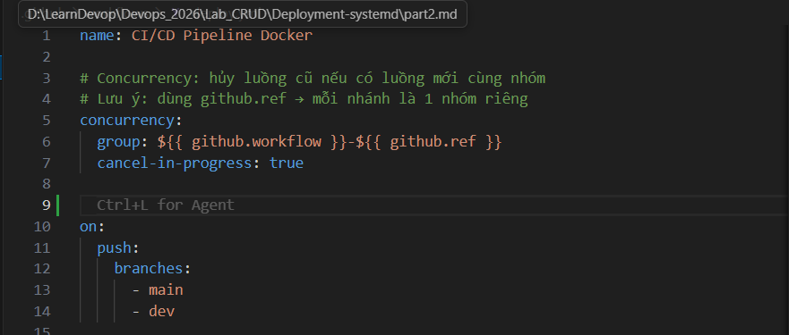
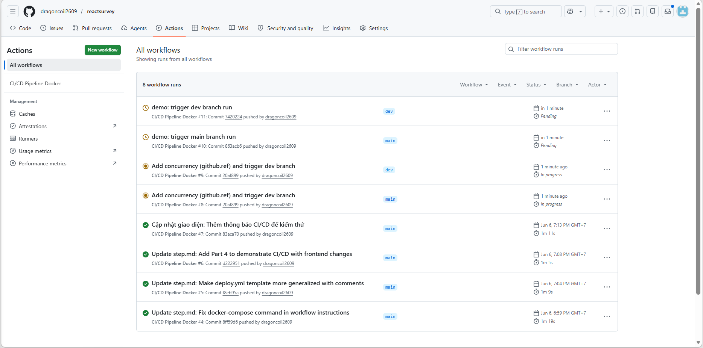

Để khắc phục triệt để, chỉ cần xóa bỏ biến `${{ github.ref }}`. Khi đó, mọi luồng dù xuất phát từ bất kỳ nhánh nào cũng sẽ phải xếp hàng chung vào một nhóm duy nhất:

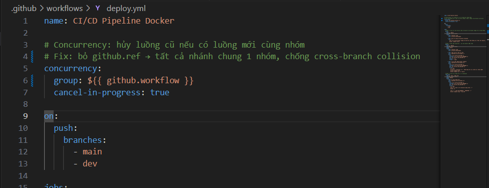
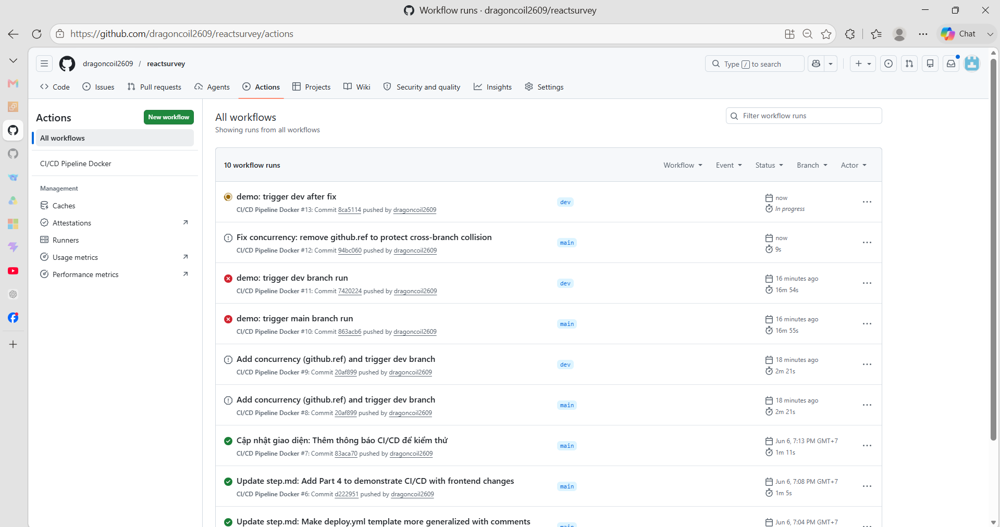

> Tham khảo tài liệu: [Using concurrency - GitHub Docs](https://docs.github.com/en/actions/using-jobs/using-concurrency)

## Quy tắc nhánh đọc YAML

Ở các hệ thống cơ bản, pipeline thường chỉ lắng nghe sự kiện `push` hoặc `pull_request`. Nhưng thực tế, hệ sinh thái kích hoạt (trigger) của GitHub Actions đồ sộ hơn rất nhiều:
- **`schedule`:** Hẹn giờ chạy luồng theo cú pháp cron (ví dụ: quét bảo mật lúc 2h sáng).
- **`check_run` / `check_suite`:** Lắng nghe phản hồi từ các hệ thống đánh giá chất lượng mã nguồn (như SonarQube).
- **`branch_protection_rule`:** Chạy khi có người thay đổi luật bảo vệ nhánh.
- **`delete` / `discussion`:** Chạy tiến trình dọn dẹp khi có nhánh bị xóa, hoặc phát thông báo khi có bình luận mới.

*Quy tắc ngầm:* Sự kiện đẩy code (`push`) sẽ luôn đọc file YAML ở ngay nhánh vừa đẩy lên. Nhưng đối với các sự kiện "ngoại cảnh" (không gắn liền với một đoạn code cụ thể như `schedule`, `discussion`...), GitHub chỉ quét tìm file YAML ở **nhánh mặc định (`main`)**. 

**(Thực hành) Vấn đề với Cron job:**
Nhiều lập trình viên tạo nhánh `test-cron`, viết lịch hẹn giờ nhưng hệ thống không hoạt động.
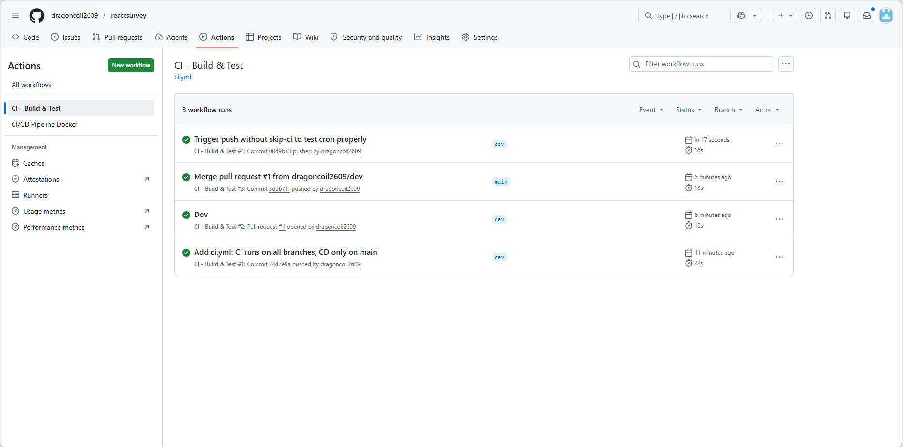
Lý do là GitHub không quét nhánh phụ để tìm lịch hẹn. Muốn lịch có hiệu lực thực tế, file YAML bắt buộc phải được merge vào nhánh `main`.
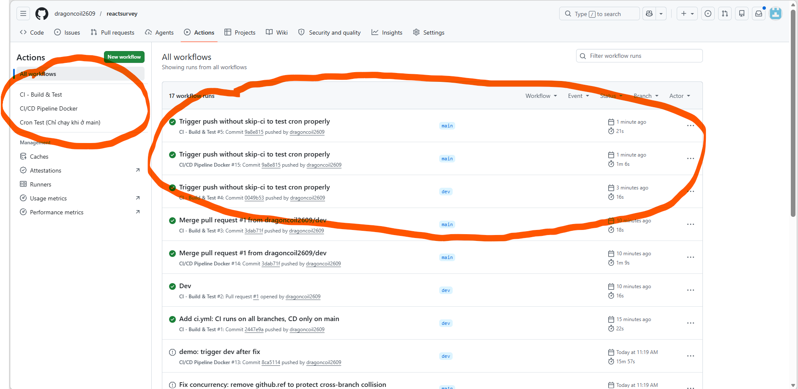

> Tham khảo tài liệu: [Events that trigger workflows - GitHub Docs](https://docs.github.com/en/actions/using-workflows/events-that-trigger-workflows)

## Họ workflow_*

Đây là bộ ba sự kiện (`dispatch` / `call` / `run`) chuyên dùng để liên kết các luồng làm việc lại với nhau, biến những file YAML rời rạc thành một chuỗi luồng phức tạp. Giống như quy tắc ở trên, file chứa các sự kiện này luôn phải được ký gửi ở nhánh `main`.

- **`workflow_dispatch`:** Sinh ra một nút bấm (Manual trigger) ngay trên giao diện web. Hỗ trợ truyền thêm các tham số (inputs) khi chạy thủ công. Hữu dụng cho các luồng rủi ro cao cần sự kiểm soát của con người như dọn dẹp server hoặc rollback.
  *(Lưu ý: Nút bấm chỉ xuất hiện khi file YAML đã nằm ở nhánh `main`. Nhưng khi nhấn nút, hệ thống cho phép chọn chạy trên bất kỳ nhánh nào).*
  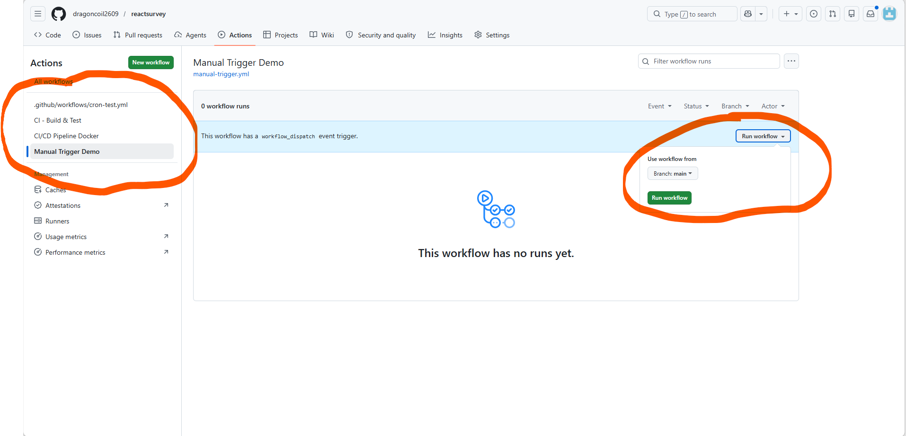

- **`workflow_call`:** Khai báo một file YAML là thư viện tái sử dụng (Reusable workflow). Giúp tránh việc lặp lại mã (copy-paste) cùng một kịch bản Deploy cho nhiều dự án. Chỉ cần sửa ở 1 nơi trung tâm, mọi repo gọi đến nó đều tự động cập nhật.
  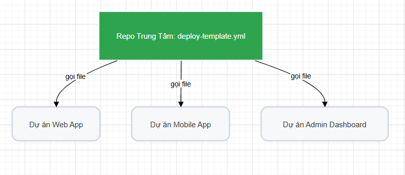

- **`workflow_run`:** Kích hoạt tự động luồng B ngay sau khi luồng A hoàn tất. Áp dụng chuẩn nguyên lý Fail-Fast: Luồng Deploy chứa mã nguồn nhạy cảm chỉ được phép chạy tiếp nếu luồng Test trước đó đã trả về trạng thái Success.

  > **⚠️ Gotcha quan trọng:** Mặc định, luồng B được kích hoạt bởi `workflow_run` sẽ tự động **checkout mã nguồn từ nhánh mặc định (`main`)**, chứ KHÔNG lấy đúng bản code đã chạy Test ở luồng A. Điều này có thể dẫn đến việc deploy nhầm mã nguồn cũ! Để sửa, bắt buộc phải chỉ định rõ SHA:
  > ```yaml
  >     - uses: actions/checkout@v4
  >       with:
  >         ref: ${{ github.event.workflow_run.head_sha }}
  > ```

  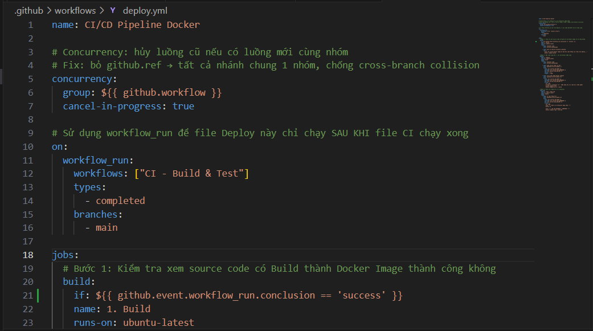
  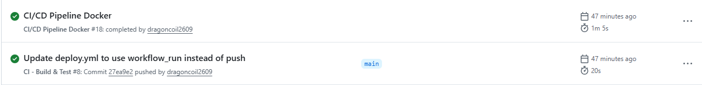

> Tham khảo tài liệu: [Reusing workflows - GitHub Docs](https://docs.github.com/en/actions/using-workflows/reusing-workflows)

## Cache dependencies

Trong các dự án NodeJS hay ReactJS, mỗi lần chạy CI/CD là một lần máy chủ phải tốn thời gian chạy `npm install` để tải lại hàng trăm MB thư viện, gây lãng phí băng thông và thời gian. Cơ chế Cache giải quyết bài toán này bằng cách nén toàn bộ thư viện tải được ở lần đầu tiên và gửi lên kho lưu trữ của GitHub. Ở các lần chạy sau, nếu danh sách thư viện không có gì thay đổi, hệ thống sẽ kéo thẳng kho cache về dùng.

Cách thực hiện:
- **Băm (Hash) file khóa thư viện:** Mỗi khi bạn cài thư viện mới, file `package-lock.json` sẽ thay đổi. Hệ thống dùng hàm `hashFiles('**/package-lock.json')` để sinh ra chuỗi mã định danh.
- **Best practice hiện đại:** Thay vì dùng `actions/cache` độc lập, hãy kích hoạt Cache thông qua `actions/setup-node@v4` — action này tích hợp sẵn `restore-keys` để tự fallback khi không tìm thấy cache chính xác:
  ```yaml
      - uses: actions/setup-node@v4
        with:
          node-version: '20'
          cache: 'npm'  # Tự động quản lý cache + restore-keys
      - run: npm ci
  ```
Kết quả: Nếu thư viện không đổi, mã hash sẽ khớp và hệ thống kéo cache về, giảm thời gian cài đặt từ hàng phút xuống vài giây.

*(Ảnh minh họa: Lần chạy đầu tiên - Không tìm thấy Cache, phải tải lại từ đầu)*
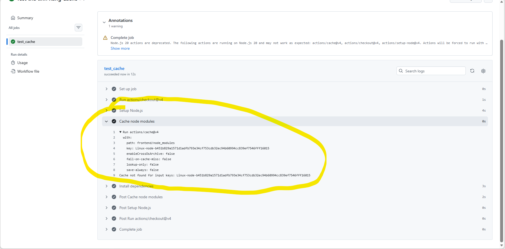

*(Ảnh minh họa: Lần chạy thứ hai - Tải nhanh từ kho Cache)*
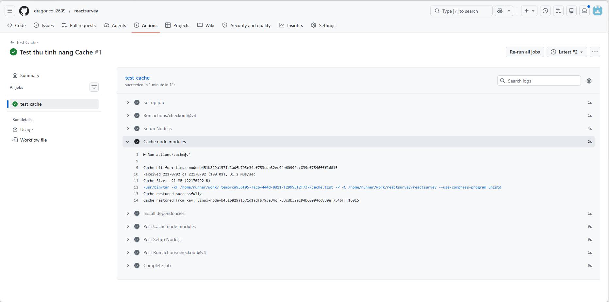

> Tham khảo tài liệu: [Caching dependencies to speed up workflows - GitHub Docs](https://docs.github.com/en/actions/using-workflows/caching-dependencies-to-speed-up-workflows)

## Matrix strategy

Bất cứ khi nào bạn phải viết lặp lại một khối lệnh (chỉ khác nhau mỗi môi trường hoặc phiên bản), đó là lúc dùng đến Matrix. Thay vì phải copy file YAML ra thành nhiều phiên bản dễ gây sai sót, Matrix tự động nhân bản cấu hình.

Một vài trường hợp thường áp dụng:
1. **Test tính tương thích:** Đảm bảo mã chạy trơn tru trên nhiều hệ điều hành (Windows, macOS, Ubuntu) và các phiên bản Node (16, 18, 20).
2. **Build Docker đa kiến trúc:** Tự động build ra nhiều Image phục vụ cùng lúc cho chip Intel (`amd64`) và ARM (`arm64`).
3. **Deploy Microservices:** Dùng 1 file YAML duy nhất để build tự động cho hàng loạt service khác nhau (user, order, payment...).

Ví dụ khai báo cấu hình test trên 3 hệ điều hành và 3 phiên bản Node:
```yaml
jobs:
  test_code:
    strategy:
      fail-fast: false  # 1 cell lỗi không có lý do gì cancel các cell khác
      matrix:
        os: [ubuntu-latest, windows-latest, macos-latest]
        node-version: [16, 18, 20]
    runs-on: ${{ matrix.os }} # Động hóa hệ điều hành
    steps:
      - uses: actions/checkout@v4
      - name: Cài đặt NodeJS
        uses: actions/setup-node@v4
        with:
          node-version: ${{ matrix.node-version }} # Động hóa phiên bản Node
```

**Kết quả:** Hệ thống tự động sinh ra $3 \times 3 = 9$ luồng chạy độc lập (Ví dụ: Ubuntu chạy Node 16...). Phát hiện lỗi chính xác ở từng môi trường.

*(Ảnh minh họa: Hệ thống tự động sinh ra 9 luồng chạy song song từ 1 cấu hình duy nhất)*
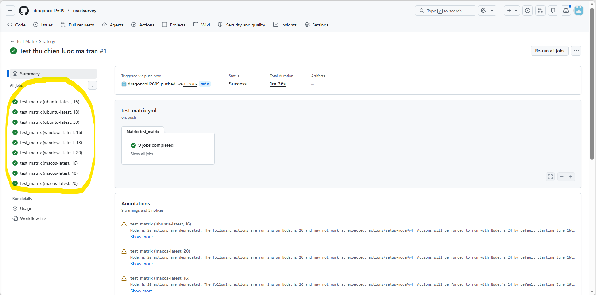

> Tham khảo tài liệu: [Using a matrix for your jobs - GitHub Docs](https://docs.github.com/en/actions/using-jobs/using-a-matrix-for-your-jobs)

## Docker Hub

Hạn chế lớn nhất ở Part 1 là việc dùng SCP copy từng file mã nguồn trực tiếp, khiến máy chủ EC2 phải vừa làm web server vừa kiêm nhiệm build server, dễ gây cạn kiệt tài nguyên.

Kiến trúc chuẩn DevOps yêu cầu nhường lại tác vụ nặng cho GitHub Actions. Mã nguồn sẽ được đóng gói sẵn thành Docker Image, đẩy lên Docker Hub. EC2 chỉ việc kéo Image đã đóng gói về và khởi chạy.

Hai lưu ý quan trọng khi cấu hình:
1. **Sử dụng Personal Access Token (PAT):** Không nên lưu trực tiếp Mật khẩu tài khoản Docker Hub vào GitHub Secrets (`DOCKER_PASSWORD`). Hãy vào phần Security trên Docker Hub để tạo một Personal Access Token. Dùng PAT giúp tăng cường tính bảo mật và dễ dàng thu hồi nếu bị lộ.
2. **Không lạm dụng tag `:latest`:** Việc đẩy Image lên với tag `:latest` sẽ khiến bạn rất khó khăn để Rollback khi có lỗi xảy ra ở bản mới. Thay vào đó, hãy sử dụng `${{ github.sha }}` để đánh tag Image theo mã băm của từng lượt commit. Như vậy mỗi bản build sẽ có một ID duy nhất.

**(Thực hành) Tối ưu hóa tốc độ với cấu trúc 2 Job:**
Khai báo hai biến môi trường `DOCKER_USERNAME` và `DOCKER_PASSWORD` (chứa PAT) vào kho Secrets của GitHub.
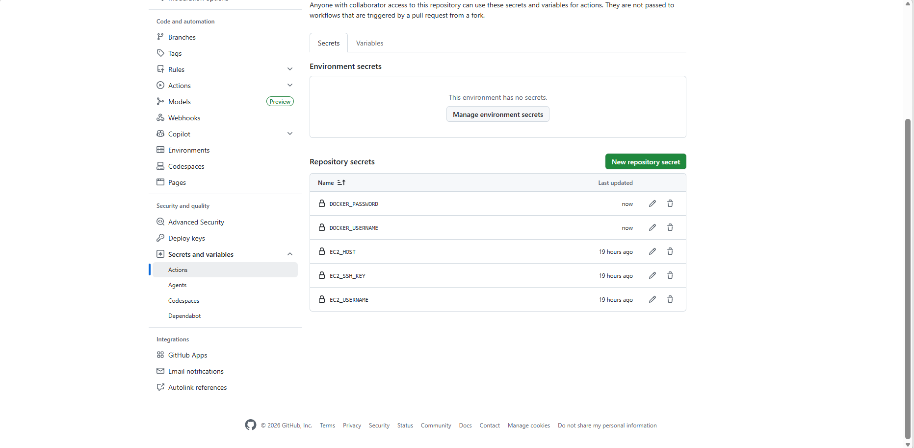

Tách luồng thành hai tiến trình rõ rệt: 
- **Job 1 (Build & Push)**: Đóng gói và gửi Image lên kho. 
- **Job 2 (Deploy Fast)**: Máy ảo EC2 kéo trực tiếp Image đã đóng gói sẵn từ Docker Hub về dùng.
Lệnh SCP ở Job 2 giờ đây chỉ cần truyền qua tệp `docker-compose.yml`, giúp việc Deploy diễn ra nhanh chóng và ổn định hơn hẳn.

*Mẫu YAML cho Job Build & Push:*
```yaml
  build_and_push:
    runs-on: ubuntu-latest
    steps:
      - uses: actions/checkout@v4

      - name: Đăng nhập Docker Hub
        uses: docker/login-action@v3
        with:
          username: ${{ secrets.DOCKER_USERNAME }}
          password: ${{ secrets.DOCKER_PAT }}   # Dùng PAT, không dùng password

      - name: Setup Buildx
        uses: docker/setup-buildx-action@v3

      - name: Build và Push với SHA tag
        uses: docker/build-push-action@v5
        with:
          context: .
          push: true
          tags: |
            ${{ secrets.DOCKER_USERNAME }}/my-app:${{ github.sha }}
            ${{ secrets.DOCKER_USERNAME }}/my-app:latest
```

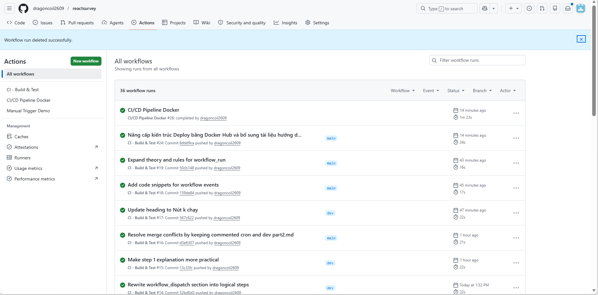

> Tham khảo tài liệu: [Publishing Docker images - GitHub Docs](https://docs.github.com/en/actions/publishing-packages/publishing-docker-images)

## permissions: block

Mặc định, GitHub Actions được cấp một thẻ thông hành (`GITHUB_TOKEN`) có đặc quyền đọc/ghi khá rộng. Nguyên tắc "đặc quyền tối thiểu" (Least-Privilege) buộc chúng ta phải thu hẹp mọi đặc quyền mặc định, luồng nào cần việc gì thì mới cấp đúng quyền đó.

Cách thiết lập:
Ở đầu file `.yml`, thêm khối `permissions` và giới hạn về trạng thái chỉ đọc:
```yaml
permissions: read-all # Hoặc khắt khe hơn: permissions: {}
```
*(Ảnh minh họa: Tiến trình báo lỗi 403 Forbidden do bị tước quyền ghi)*
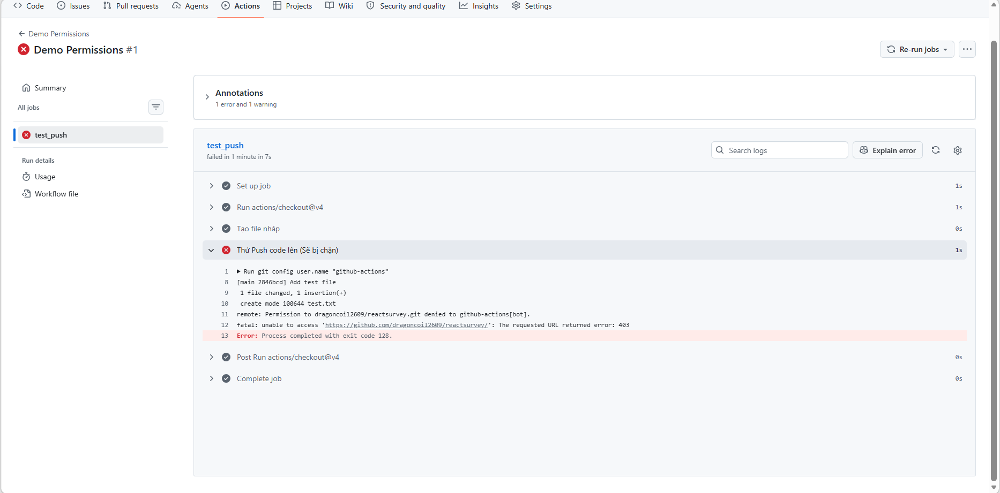

Sau đó, chỉ cấp quyền cần thiết ở cấp độ Job. Ví dụ, Job cần xin token OIDC của AWS thì chỉ cấp quyền đó:
```yaml
jobs:
  deploy:
    permissions:
      id-token: write # Chỉ cấp quyền sinh token ngắn hạn
      contents: read  # Quyền đọc mã nguồn
```
*(Ảnh minh họa: Tiến trình chạy thành công sau khi được cấp quyền chuẩn)*
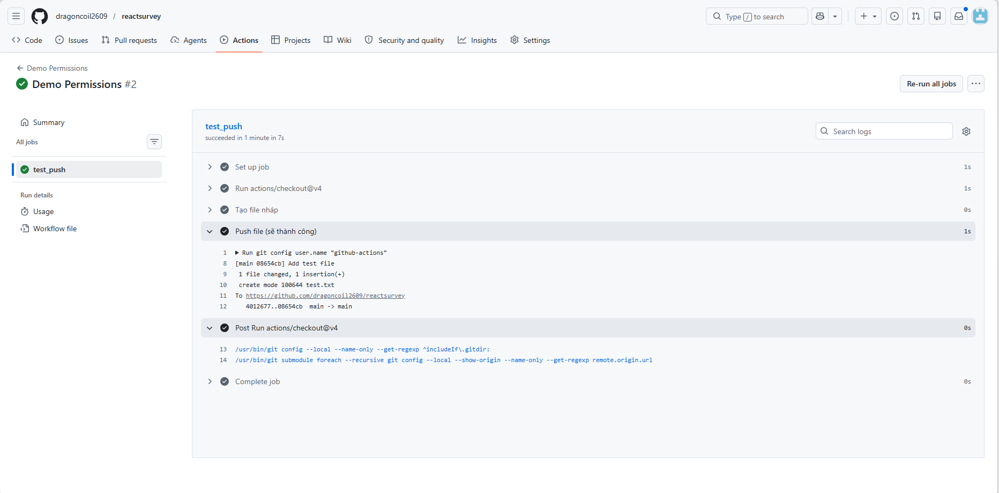

> Tham khảo tài liệu: [Assigning permissions to jobs - GitHub Docs](https://docs.github.com/en/actions/using-jobs/assigning-permissions-to-jobs)


## OIDC cho AWS

Lưu trữ khóa tĩnh (như `AWS_ACCESS_KEY` hay `EC2_SSH_KEY`) vào GitHub Secrets tiềm ẩn rủi ro lộ lọt khóa vĩnh viễn. Bảo mật hiện đại ưu tiên sử dụng OpenID Connect (OIDC). Hai hệ thống AWS và GitHub sẽ xác thực trực tiếp với nhau thông qua "Token ngắn hạn". Khi luồng kết thúc, Token cũng tự hủy.

Cách cấu hình OIDC:
- **Đăng ký Identity Provider:** Vào AWS IAM, tạo một Identity Provider (Đối tác tin cậy) trỏ URL về kho quản lý token của GitHub (`token.actions.githubusercontent.com`). Thumbprint điền: `6938fd4d98bab03faadb97b34396831e3780aea1`.
- **Tạo IAM Role với Trust Policy:** Đây là bước khó nhất. Cấu trúc JSON mẫu để AWS chỉ tin tưởng token từ đúng repo/nhánh `main`:
  ```json
  {
    "Version": "2012-10-17",
    "Statement": [{
      "Effect": "Allow",
      "Principal": {
        "Federated": "arn:aws:iam::ACCOUNT_ID:oidc-provider/token.actions.githubusercontent.com"
      },
      "Action": "sts:AssumeRoleWithWebIdentity",
      "Condition": {
        "StringEquals": {
          "token.actions.githubusercontent.com:aud": "sts.amazonaws.com"
        },
        "StringLike": {
          "token.actions.githubusercontent.com:sub": "repo:OWNER/REPO:ref:refs/heads/main"
        }
      }
    }]
  }
  ```
- **Xin quyền Token trong file YAML:** Thêm quyền `id-token: write`.
- **Sử dụng action cấu hình:** Truyền định danh ARN của Role vào bước chạy:
  ```yaml
  - name: Configure AWS credentials
    uses: aws-actions/configure-aws-credentials@v4
    with:
      role-to-assume: arn:aws:iam::111122223333:role/MyGitHubDeployRole
      aws-region: ap-southeast-1
  ```

*(Ảnh minh họa: Cấu hình OIDC thành công)*
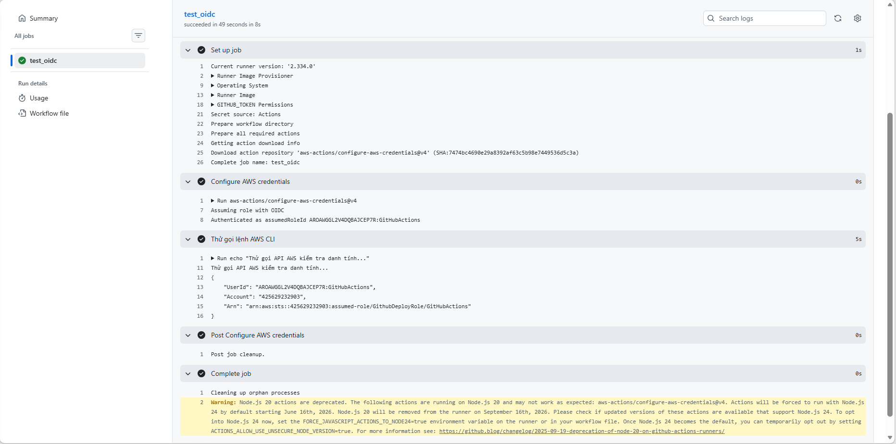

> Tham khảo tài liệu: [Configuring OpenID Connect in Amazon Web Services - GitHub Docs](https://docs.github.com/en/actions/deployment/security-hardening-your-deployments/configuring-openid-connect-in-amazon-web-services)

## Environment & Required Reviewers

Tự động hóa hoàn toàn luồng Deploy lên môi trường Production có thể mang lại rủi ro nếu không được kiểm duyệt. Tính năng `environment` kèm theo Cổng phê duyệt (Required reviewers) giúp hệ thống tạm dừng để chờ sự phê duyệt (Approve) từ con người trước khi lên sóng.

Cách thiết lập:
- Tạo môi trường ảo tên `production` trong **Settings > Environments** của repo.
- Tích chọn "Required reviewers" và thêm tài khoản của người đánh giá.
- Trong YAML, bổ sung thuộc tính `environment` vào Job:
  ```yaml
  jobs:
    deploy_to_ec2:
      runs-on: ubuntu-latest
      environment: production # Gắn thẻ môi trường
      steps:
        # Các bước deploy...
  ```

Ngoài Required Reviewers, Environment còn hỗ trợ các tính năng nâng cao khác:
- **Wait timer:** Sau khi Reviewer bấm Approve, hệ thống vẫn đợi thêm X phút rồi mới thực thi — thời gian để phát hiện vấn đề trước khi deploy chính thức.
- **Branch restriction:** Chỉ cho phép nhánh `main` deploy lên môi trường Production. Các nhánh feature/dev bị chặn.
- **Environment-scoped secrets:** Lưu Secrets riêng biệt cho từng môi trường (Staging / Production). Luồng Staging chỉ đọc được Secrets của Staging, không bao giờ chạm đến Secrets Production.

Kết quả: Khi luồng chạy qua các bước Test và chuyển tới Deploy, nó sẽ ở trạng thái chờ. Chỉ khi Reviewer bấm duyệt, Job Deploy mới được kích hoạt.

*(Ảnh minh họa: Luồng Deploy bị tạm dừng để chờ Reviewer duyệt)*
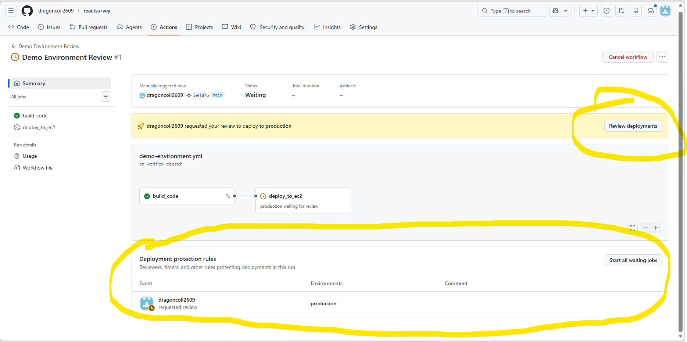

> Tham khảo tài liệu: [Using environments for deployment - GitHub Docs](https://docs.github.com/en/actions/deployment/targeting-different-environments/using-environments-for-deployment)

## Tổng kết: Checklist áp dụng cho Pipeline

Sau khi nắm vững các kỹ thuật nâng cao, hãy dùng danh sách kiểm tra (checklist) này để rà soát lại và nâng cấp cho luồng CI/CD (Part 1) của bạn:

- [ ] Giới hạn chạy song song với `concurrency: group: ${{ github.workflow }}`
- [ ] Thiết lập Cache cho các file tải về (npm, pip) để tăng tốc độ cài đặt
- [ ] Tách `deploy` thành 2 Job độc lập: 1 Build Image đẩy lên Hub, 1 Kéo Image về EC2
- [ ] Áp dụng Matrix Strategy nếu cần test trên nhiều môi trường Node/OS
- [ ] Chuyển đổi mật khẩu Docker Hub sang Personal Access Token (PAT)
- [ ] Gắn thẻ Image bằng `${{ github.sha }}` thay vì `:latest`
- [ ] Thu hẹp `permissions` ở cấp độ Job thay vì dùng mặc định
- [ ] Chuyển đổi từ `AWS_ACCESS_KEY` sang OIDC role-to-assume
- [ ] Thiết lập `environment` cho luồng Production để bật tính năng chờ duyệt
